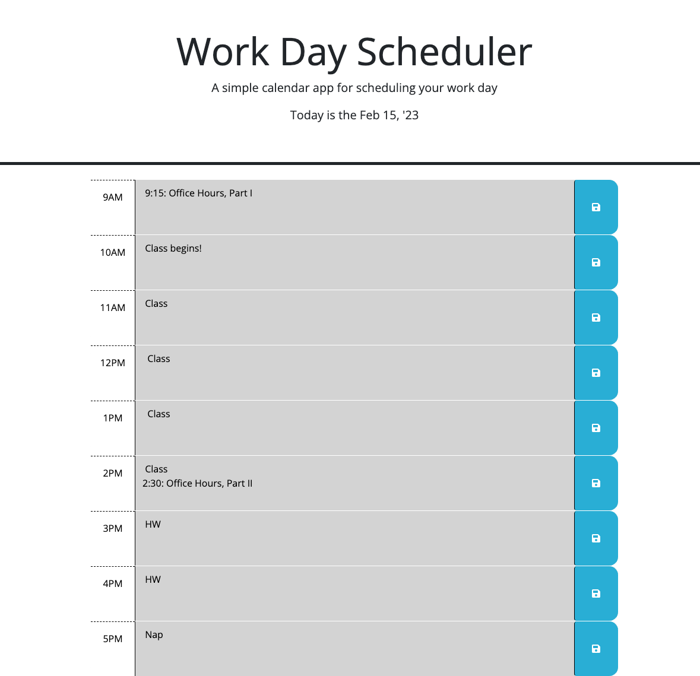

# Work Scheduler

## Description

This repo demonstrates a single-day work scheduler that shows the current date, the working hours of that date (color coded for past, present, and future), and allows the user to save events for particular hour-long time slots in local storage that will continue to populate the scheduler on each reload. This repo started with starter code and allowed me to gain greater practice in my use of JavaScript without building a site from scratch – also in jQuery, though generally vanilla JS seemed to feel more intuitive to me. One jQuery solution for a particular part of the page functionality exists and has been commented out. 

Though there is a heavy debate among developers over whether jQuery should still be in use, it obviously still has a massive user base. However, its use moving forward seems to be on the decline, or at least new tools are available that now can be used in its place (conversations about or evidence of this can be seen [here](https://medium.com/@apoorva72900/why-is-jquery-dead-b41dba56491e#:~:text=JQuery%20is%20useful%2C%20but%20what,So%2C%20it%20started%20becoming%20obsolete.), [here](https://thenewstack.io/why-outdated-jquery-is-still-the-dominant-javascript-library/), and [here](https://youmightnotneedjquery.com/)). Given this, and as I still more naturally think in vanilla JS (and am still trying to build my skills with it), much of this was accomplished using vanilla JS instead, as much of jQueries initial benefits are now part of vanilla JS.

## Installation

No installation necessary.

## Usage

Visit the page here [here](https://coldweatherboyy.github.io/work-day-scheduler/), which allows users to enter their schedule into hour-long timeslots. Click the save buttons on the right to save these. Each time the user visits the page, the page will retain all saved user inputs.

Screenshot of page below: 

## Credits

Conceptual brainstorming done with [Jake Rudlong](https://github.com/JDR8888).